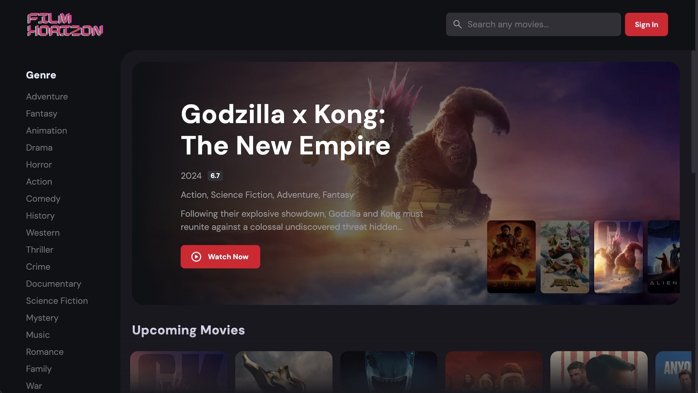
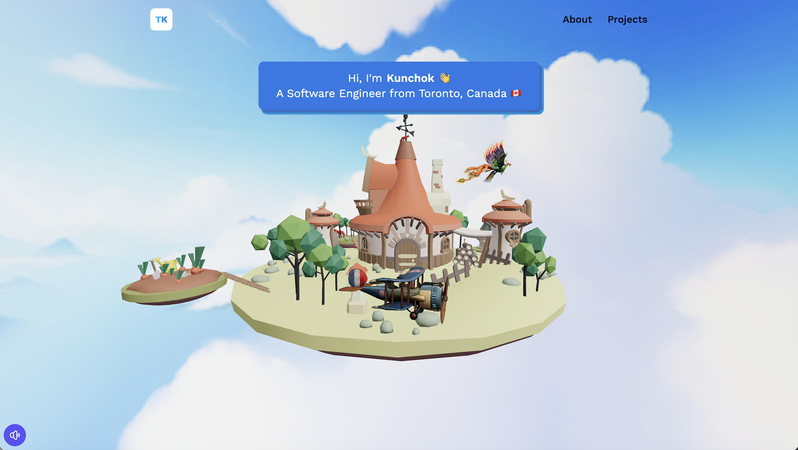

<h1 align="center">Hello, <a href="https://github.com/tenzinkunchok25" 
  title="Profile">I'm Tenzin Kunchok</a>👋</h2>

 

  👩🏻‍💻 I'm a Software Engineer from Toronto, Canada 
  👩🏻‍🎓 Studied Computer Science at York University, Toronto 
  🨠creating visually appealing websites is what excites me 
  💭 Currently interested in learning to create 3D websites 
  🌷 Hope to get into Machine learning and AI, but a long journey is ahead 
   
  📫 How to reach me:

  
  

 

  
  

  </a>

<h1 align="center">💻 Tech Stack</h1>

  
  
  
  
  
  
  
  
  
  
    

<h1 align='center'>📱Projects</h1>

<table>
  <tr>
    <td width='40%' colspan=2>
      <h2 align='center'>Film Horizon</h2>
      
  
        
         
         
        

          
          
        

        
        
        
        
      

    </td>
 </tr>
  <tr>
    <td width='40%'>
      <h2 align='center'>3D Portfolio</h2>
      
  
        
         
         
        

          
          
        

        
        
        
        
        
         
         
      

    </td>
    <td width='40%'>
      <h2 align='center'>Netflix</h2>
      
  
        
         
         
        

          
          
        

        
          
      

    </td>
 </tr>  
</table>

<h1>🏆 Trophies</h1>

